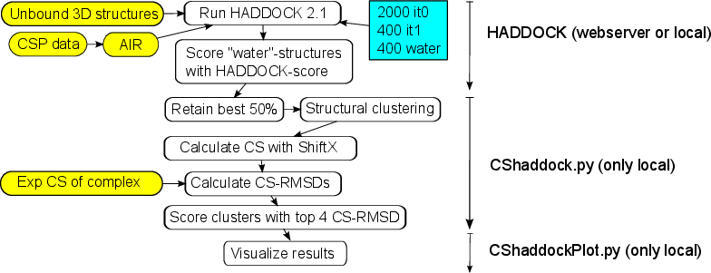
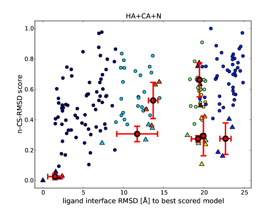
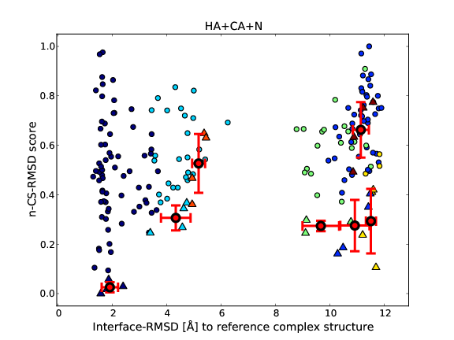

This document describes CS-HADDOCK, a re-scoring method that uses chemical shift data quantitatively to score HADDOCK models.

#### Table of contents
{:.no_toc}
* table of contents
{:toc}

<br>

**CS-HADDOCK version1.0** with documentation and examples [**can be downloaded here**](https://surfdrive.surf.nl/files/index.php/s/3LNcPztOn3R0vvB).

Any support request can be directed to Dr. Dirk Stratmann [dirk.stratmann@upmc.fr](mailto:dirk.stratmann@upmc.fr?Subject=CS-HADDOCK request)

<hr>

## 1. What is CS-HADDOCK?

Nuclear Magnetic Resonance (NMR) chemical shifts (CS) are only used qualitatively in the protein-protein docking program HADDOCK via ambiguous distance restraints derived from chemical shift perturbation (CSP) data. CS-HADDOCK is a re-scoring method that uses chemical shift data quantitatively. If sufficient chemical shift data from the protein-protein complex is available, the best cluster of models ranks very often at the first position with this re-scoring method.

<br>


<div style="text-align:center;">
<br>
<p><b>Figure 1.</b> Flowchart of the CS-HADDOCK protocol</p>
</div>


The CS-HADDOCK docking protocol is shown in *Figure 1*. First HADDOCK has to be run using the default parameters, except of a doubling of the generated structures (2000 it0, 400 it1, 400 water). It is strongly recommended to restrict the search space near to the binding site, using preferably experimental data (for example chemical shift perturbation (CSP) data) for this task. Once the active and passive residues defined from the experimental data, HADDOCK automatically generates Ambiguous Interaction Restraints (AIR) to restrict the search space. Once the HADDOCK run is finished, the final water refined structures (in the structures/it1/water subdirectory) will be re-scored with the **CShaddock.py** script. This python script takes the experimental chemical shifts (Exp. CS.) of the protein-protein complex and compares them to the calculated chemical shifts of each water refined structure. It uses ShiftX for the prediction of the chemical shifts.

## 2. Installation and testing

CS-HADDOCK is a command line executable without any graphical interface. It works only in Linux or Mac OS X. Its installation is straightforward:

Unpack the tar.gz archive:

```bash
tar xvzf CShaddock_1.0.tgz
```

A directory `CShaddock_1.0` will be created, containing the two python scripts `CShaddock.py` and `CShaddockPlot.py` and six sub-directories:

```
    data/           → the input data of the given examples
    doc/            → the documentation of CS-HADDOCK including the present PDF
    par/            → the parameter files of the given examples
    run/            → the water-refined models of the complex obtained from a HADDOCK run
    out/            → the output files of the given examples
    shiftxSource/   → source code of ShiftX for Mac OS X users.
```

The CShaddock.py python script requires the “numpy” library ([http://numpy.scipy.org/](http://numpy.scipy.org/)) to be installed for python.

The CShaddockPlot.py python script requires the “matplotlib” (import pylab) library (http://matplotlib.sourceforge.net/) to be installed for python.

Beside the two python scripts the “CShaddock_1.0” directory contains also the “shiftx” executable ([http://shiftx.wishartlab.com/](http://shiftx.wishartlab.com/)) for Linux. The “shiftx” executable must be in the same directory as CShaddock.py. If you are using Mac OS X, you will have to compile ShiftX from source. The ShiftX source can be found under: [http://wishartlab.com/download/shiftx/](http://wishartlab.com/download/shiftx/). With permission of the authors, a copy of the ShiftX source as obtained on the 3th November 2011 is also included in the CS-HADDOCK distribution in the “shiftxSource” subdirectory.

CS-HADDOCK can be executed simply from inside the directory "CShaddock_1.0" by typing:

```bash
python CShaddock.py parameter-file
```

Optionally, the scoring results can be visualized with “CShaddockPlot.py” by typing:

```bash
python CShaddockPlot.py parameter-file
```

after the execution of “CShaddock.py”. It will plot the results and save the results as PDF files.

Four examples are given with the current distribution of CS-HADDOCK. The correct installation of CS-HADDOCK can be tested by executing one or all four examples. From a terminal window go into (via cd) the installed directory "CShaddock_1.0" and execute one of the four commands:

```bash
python CShaddock.py par/E9-IM9/E9-IM9.par
python CShaddock.py par/EIN-HPR/EIN-HPR.par
python CShaddock.py par/ILK-PINCH/ILK-PINCH.par
python CShaddock.py par/ZTaq/ZTaq.par
```

After a short runtime of some minutes CS-HADDOCK should have written all output files into the output directory "out/xxx" (xxx = name of example).

As detailed below in the "Input & Output" section, CS-HADDOCK writes several *.scores files, one for each of the CS combinations given in the parameter file plus one file with the original HADDOCK score. The score values can be plotted by “CShaddockPlot.py” against the RMSD values to the best structure. After the successful execution of “CShaddock.py” type the corresponding command to run “CShaddockPlot.py”:

```bash
python CShaddockPlot.py par/E9-IM9/E9-IM9.par
python CShaddockPlot.py par/EIN-HPR/EIN-HPR.par
python CShaddockPlot.py par/ILK-PINCH/ILK-PINCH.par
python CShaddockPlot.py par/ZTaq/ZTaq.par
```

CShaddockPlot.py will generate PDF-files in the same output directory, where the *.scores files are. To obtain more information about the syntax of the output files, please read the section "Output files" below.

## 3. CS-HADDOCK input

The current distribution of CS-HADDOCK 1.0 contains the following five sub-directories:

```
    data/           → the input data of the given examples
    doc/            → the documentation of CS-HADDOCK including the present PDF
    par/            → the parameter files of the given examples
    run/            → the water-refined models of the complex obtained from a HADDOCK run
    out/            → the output files of the given examples
```
The "data", “par”, “run” and "out" subdirectories contain a subdirectory for each example, e.g. data/E9-IM9.

### Input data

The “data” subdirectory contains the input data files for CS-HADDOCK. The chemical shift data files (*.str) are in the BMRB NMR-STAR format. These files are the only experimental input data needed by CShaddock.py. The water refined models obtained from HADDOCK are in the “run” subdirectory. The distributed examples have additional files in the “data” subdirectory not required by CShaddock.py :

* The PDB files of the free-form starting structures used by HADDOCK.
* The ambiguous distance restraints data file (ambig.tbl) used by HADDOCK and obtained from CSP data analysis.
* The parameter file of the HADDOCK webserver (haddockparam.web) used to generate the models in the “run” subdirectory.
* The ana_scripts subdirectory contains the reference complex structure and the HADDOCK “i-rmsd_to_xray.csh” script to calculate the interface-RMSD values to the reference structure. To use this script you will need **ProFit** ([http://www.bioinf.org.uk/software/profit/index.html](http://www.bioinf.org.uk/software/profit/index.html)). For the distributed examples the interface-RMSD values have already been calculated and saved as “i-RMSD.dat” in the “run” subdirectory.


### Input parameters

The “par” subdirectory contains the parameter file for CS-HADDOCK. Each parameter has an identifier and a value (integer or string) written on an individual line and separated by one or more space(s) or tabulator(s). The order of the parameters is not relevant for CS-HADDOCK, but they should be organized in a similar way as in the examples distributed with CS-HADDOCK.

The list of parameters is given in Table 1.

<div style="text-align:center">
<b>Table 1</b>: Parameters in the *.par file
</div>

<table border="1" cellpadding="5" cellspacing="0" width="100%">
<tbody>
<tr>
<td>
<p><strong>name</strong></p>
</td>
<td>
<p><strong>description</strong></p>
</td>
<td>
<p><strong>possible values</strong></p>
</td>
<td>
<p><strong>default</strong></p>
</td>
</tr>
<tr>
<td>
<p>Water-directory</p>
</td>
<td>
<p>The relative or absolute path to the water subdirectory of a HADDOCK run, i.e. the directory that contains the 400 water refined PDB structures</p>
</td>
<td>
<p>run/E9-IM9/water/</p>
</td>
<td>
<p>&nbsp;</p>
</td>
</tr>
<tr>
<td>
<p>Output-directory</p>
</td>
<td>
<p>The relative or absolute path to the directory where the results will be saved</p>
</td>
<td>
<p>out/E9-IM9/</p>
</td>
<td>
<p>&nbsp;</p>
</td>
</tr>
<tr>
<td>
<p>CS_A</p>
</td>
<td>
<p>The relative or absolute path to the data file in the BMRB Star-format containing the experimental chemical shifts of the chain A bound to the chain B.</p>
</td>
<td>
<p>data/E9-IM9/E9.str</p>
</td>
<td>
<p>&nbsp;</p>
</td>
</tr>
<tr>
<td>
<p>CS_B</p>
</td>
<td>
<p>As for CS_A, but here the exp. CS of chain B bound to the chain A.</p>
</td>
<td>
<p>data/E9-IM9/IM9.str</p>
</td>
<td>
<p>&nbsp;</p>
</td>
</tr>
<tr>
<td>
<p>CS_CHAIN-ID</p>
</td>
<td>
<p>Specifies which chain(s) are used for the CS-RMSD score calculations.</p>
</td>
<td>
<p>AB, A or B</p>
</td>
<td>
<p>AB</p>
</td>
</tr>
<tr>
<td>
<p>CS_TYPES</p>
</td>
<td>
<p>The list of nuclei for which ShiftX should calculate theo. CS values</p>
</td>
<td>
<p>HA H N CA CB C</p>
</td>
<td>
<p>HA H N CA CB</p>
</td>
</tr>
<tr>
<td>
<p>CS_combination</p>
</td>
<td>
<p>Calculates the CS-RMSD score with the given combination of nuclei. Any subset of the list of nuclei given for CS_TYPES can be given here. Different combinations can be used separately by writing more than one &ldquo;CS_combination&rdquo; line in the parameter file.</p>
</td>
<td>
<p>any subsets of CS_TYPES</p>
</td>
<td>
<p>HA CA N</p>
</td>
</tr>
<tr>
<td>
<p>FILEROOT</p>
</td>
<td>
<p>The fileroot name for the water refined PDB structures (see HADDOCK documentation)</p>
</td>
<td>
<p>complex</p>
</td>
<td>
<p>complex</p>
</td>
</tr>
<tr>
<td>
<p>NUM_STRUCTURES</p>
</td>
<td>
<p>The number of water refined structures to be used for the CS-RMSD score calculations. The structures are chosen by their HADDOCK score. Usually, the best 50% should be retained.</p>
</td>
<td>
<p>half of the number of water refined models</p>
</td>
<td>
<p>200</p>
</td>
</tr>
</tbody>
</table>

### Input models

The “run” subdirectory contains the water refined models obtained from a HADDOCK run. From all files generated by HADDOCK only the structures/it1/water subdirectory is needed by CS-HADDOCK. CShaddock.py will create *.shiftX files for the best NUM_STRUCTURES (according to the HADDOCK score) in the specified “Water-directory”, see Table 1. So CShaddock.py must have write access to the given “Water-directory”. It will also read the structural clustering obtained with HADDOCK and the pairwise RMSD matrix.


## 4. CS-HADDOCK output files

The output files of CS-HADDOCK are written in the specified directory in the parameter file ("Output-directory"), for example to out/protein-name.

#### \*.scores output files

CShaddock.py writes one *.scores file per CS combination given in the parameter file, plus one file with the original HADDOCK score: “proteinName_HADDOCK.scores”. The used CS combination is indicated in the file name, as well as the chains used (AB, A or B). Each file contains five or six columns:

* **Model**. The first column gives the PDB filename of the water refined model of the “Water-directory” (see parameter file). The models are ranked according to the n-CS-RMSD score or for the “proteinName_HADDOCK.scores” file according to the HADDOCK score.
* **cluster-no**. The second column gives the cluster-number of each model according to the structural clustering obtained with HADDOCK. The models that do not belong to any cluster are indicated with “noCluster”.
* **HADDOCK-score**. The third column gives the HADDOCK-score of each model (more negative values are better scores).
* **n-CS-RMSD(HA+CA+N)**. The fourth column gives the n-CS-RMSD score of each model (0.0 = best, 1.0 = worst). If only one CS type is used for the scoring, then the CS-RMSD values in ppm (lower = better) are given instead of the n-CS-RMSD values.
* **RMSD[A] to best (using n-CS-RMSD)**. The fifth column gives the structural RMSD of each model compared to the best scored model. CShaddock.py uses here the values of the pairwise RMSD-matrix given by HADDOCK (in the subdirectory: analysis/+FILEROOT+_rmsd.disp). HADDOCK calculates the ligand interface RMSD for the pairwise RMSD-matrix.
* **interface-RMSD[A] to reference**. The last column is only shown, if a reference structure is available to compare the results to it. The comparison can be done by various metrics, as for example by the interface-RMSD. CShaddock.py searches for one of the following files in the water-directory:
    * i-RMSD.dat (interface RMSD)
    * l-RMSD.dat (ligand RMSD)
    * CA-RMSD.dat ( C α RMSD)
    * file.nam_fnat (fraction of native contacts)


#### \*.stat_best4 output files

Beside the `*.scores` output files, CShaddock.py writes also some information for each structural cluster. The `*.stat_best4` files contain five columns: #Cluster, score-mean, score-std, RMSD-mean and RMSD-std

* The first column gives the structural cluster number by indicating the corresponding file name in the “Water-directory”. The file.nam_clust# files contain the list of PDB models that belong to the cluster.
* The second column gives the average score among the best (according to the used score) four structures of a cluster.
* The third column gives the standard deviation of the scores of the best four structures.
* The fourth column gives the average structural RMSD of all best four structures against the best structure among the four. The RMSD values of the pairwise RMSD matrix given by HADDOCK are used here (analysis/+FILEROOT+_rmsd.disp).
* The last column gives the corresponding standard deviation for of the average structural RMSD among the best four structures.


#### \*.pdf output files

After running CShaddock.py, the results given by the `*.scores` files can be visualized by executing CShaddockPlot.py (see above). CShaddockPlot.py generates one or two PDF file(s) per `*.scores` file, plotting the score against the RMSD values and using the clustering information given by HADDOCK. Figure 2 shows one example of PDF files generated by CShaddockPlot.py.





<div style="text-align:center;">
<br>
<p><b>Figure 2.</b> Example of a PDF output file generated by CShaddockPlot.py on the E9-IM9 complex. Each point correspond to one model. Each cluster has a different colour. The average+std among the best four structures is indicated by red crosses. Lower scores are better scores. The top figure compares all 200 structures against the best scored structure, using the ligand interface RMSD values as given by the pairwise RMSD-matrix from HADDOCK. The bottom figure can only be obtained, if a reference structure is available. Then all 200 models can be compared to it, as shown here in terms of interface RMSD.</p>
</div>


##  Reference

Dirk Stratmann, Rolf Boelens, Alexandre M. J. J. Bonvin (2011). [Quantitative use of chemical shifts for the modeling of protein complexes](http://dx.doi.org/10.1002/prot.23090) Proteins: Structure, Function, and Bioinformatics Volume 79, Issue 9, pages 2662–2670.