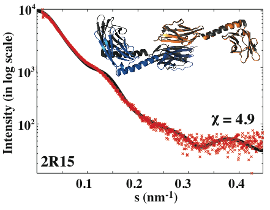
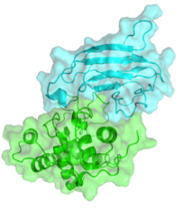
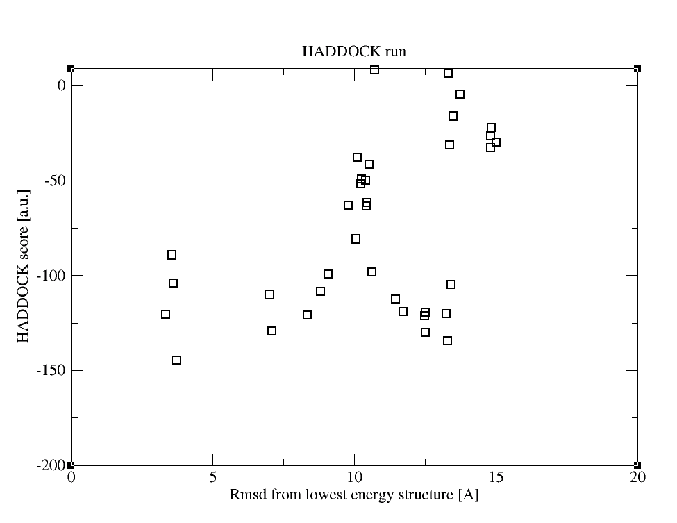
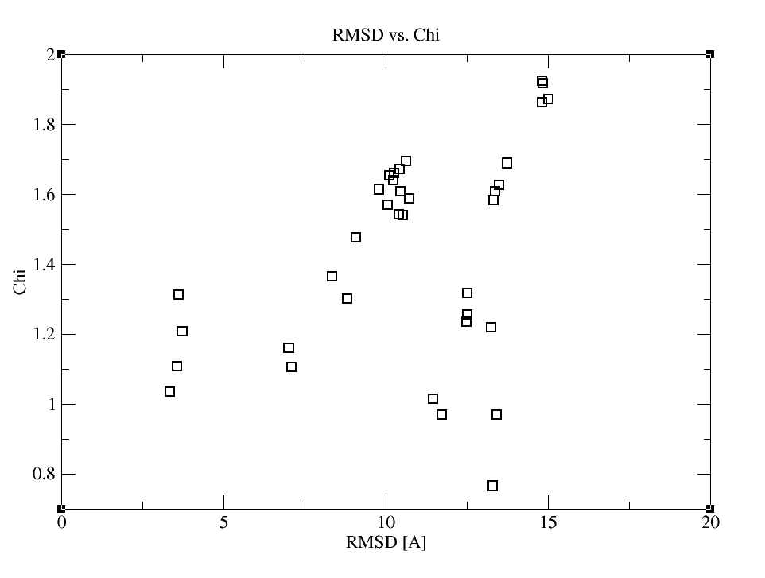
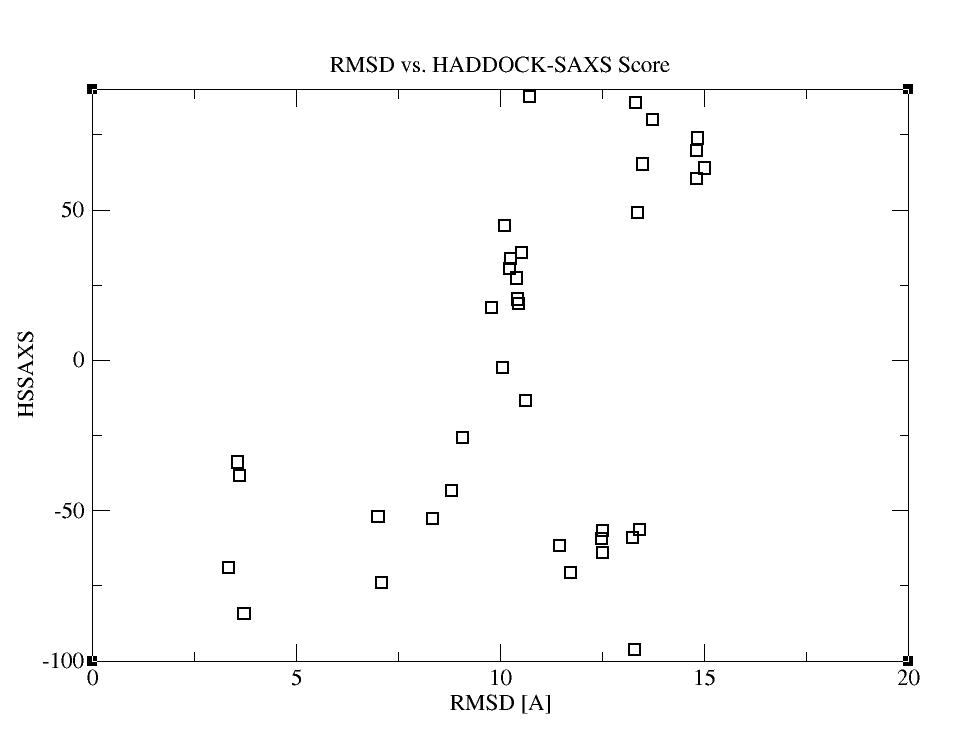

In this tutorial, we will introduce SAXS data and their use in HADDOCKing. This is a scoring exercise, therefore you won’t need to set a new docking run to go over it, rather you will analyze a provided pre-docked run.

#### Table of contents
{:.no_toc}
* table of contents
{:toc}

<br>
<hr>

## 1. Introduction to SAXS data

Small Angle X-Ray Scattering (SAXS) allows the characterization of biomolecular complexes under native conditions. It measures the intensity scattered by a protein sample at low scattering angles. From the scattering profile, size- and shape-related information, such as molecular weight, radius of gyration, maximum molecular dimension and a low-resolution 3D molecular envelope, can be extracted. (For more information on the SAXS data and the tools to interpret it, you can visit the related WeNMR services page.)

To this end, the SAXS information is typically translated into:  

   **(i)** a molecular envelope, which can guide the construction of ab initio bead models or the docking of individual 3D structures,      

   **(ii)** a restraining energy term, which can be used to refine structure directly against the SAXS curve (often in combination with orientational NMR restraints)    

   **(iii)** a scoring term that calculates the discrepancy (Chi-or-χ) between the experimental scattering curve and the back-calculated one from the model. 

In this tutorial we focus on point (iii), we will investigate the information-content of SAXS data and its usefulness in filtering docking decoys.

## 2. Introduction to CRYSOL and Chi (χ)

For the discrepancy (χ) calculation, we will use [CRYSOL](http://www.embl-hamburg.de/biosaxs/crysol.html), which is a freely available software to:

   **(i)** simulate the evaluation of the SAXS profile for macromolecules with known atomic structure (in PDB format).  

   **(ii)** fit the simulated scattering profile to the experimental one obtained from SAXS measurements. This is done by minimizing the discrepancy (χ2) value between two curves. If you are interested how this calculation is done, you can check CRYSOL's [reference paper](http://www.embl-hamburg.de/biosaxs/reprints/crysol_1995.pdf).



**An example CRYSOL output. The black line is the theoretical scattering curve calculated by CRYSOL (refers to the docking model-colored complex). The red crosses represent the experimental SAXS profile (measured for the black complex-PDB id: 2r15). The quality of the fit (χ) is reported as 4.9.

## 3. Incorporating Chi into HADDOCK’s scoring function

In order to probe the scoring ability the SAXS χ to discriminate near-native models, we re-ranked large set of models according to their fit to the experimental SAXS (χ) data. Our statistics revealed that χ-based SAXS scoring has a significant discriminative ability ([Karaca and Bonvin, Acta Cryst D, 2013](http://dx.doi.org/10.1107/S0907444913007063)). However, the best results were achieved when χ is combined with the regular HADDOCK score with a weight of 50:

<div style="text-align:center">
<b>HADDOCK<sub>SAXS</sub> = HADDOCK<sub>Score</sub> + 50 . χ<sub>SAXS</sub></b>
<br><br>
</div>

where HADDOCK<sub>Score</sub> refers to different combinations of individual energy terms given different docking stages:

<div style="text-align:center">
<b>it0</b> (Rigid-body): 0.01E<sub>vdW</sub> + 1.0E<sub>Elec</sub>+0.01E<sub>Restr</sub> - 0.01BSA + 1.0E<sub>Desolv</sub> + 0.1E<sub>Sym</sub>
<br><br>
<b>it1</b> (Simulated Annealing): 1.0E<sub>vdW</sub> + 1.0E<sub>Elec</sub> + 0. 1E<sub>Restr</sub>  - 0.01BSA + 1.0E<sub>Desolv</sub> + 0.1E<sub>Sym</sub>
<br><br>
<b>water</b> (Solvent Refinement): 1.0E<sub>vdW</sub> + 0.2EE<sub>lec</sub> + 0.1E<sub>Restr</sub> +1.0E<sub>Desolv</sub> + 0.1E<sub>Sym</sub>
<br><br>
</div>

Here, E<sub>vdW</sub> is the van der Waals intermolecular energy, E<sub>Elec</sub> the intermolecular electrostatic energy, E<sub>CM</sub> the restraint energy, E<sub>Desolv</sub> the empirical desolvation energy, BSA the buried surface area and, if present, E<sub>Sym</sub> the symmetry restraint energy.

## 4. Running SAXS-based HADDOCK Scoring on a Test Case

In this section, we’ll guide you through a real CAPRI modeling example. CAPRI is abbreviated for Critical Assessment of PRediction of Interactions ([http://www.ebi.ac.uk/msd-srv/capri/capri.html](http://www.ebi.ac.uk/msd-srv/capri/capri.html)). It’s a blind docking contest dedicated to the performance assessment of various docking methods.



**This example belongs to [CAPRI](http://www.ebi.ac.uk/msd-srv/capri/) round 27 (Target 58)**. It’s a lysozyme-lysozyme inhibitor complex (PDB id: [4g9s](http://www.rcsb.org/pdb/explore.do?structureId=4G9S)). Since we are going to perform a scoring exercise, we'll use a pre-docked run that was submitted for performance assessment. (To generate the models, we used a special solvated docking protocol of HADDOCK. For more information on the protocol please see [*Kastritis et al.*, Proteins, 2013](http://dx.doi.org/doi:10.1002/prot.24210)).
 
In order to be able to follow the next steps, you should download the attached tar-zipped archive **HADDOCK-SAXS-Scoring.tgz** and extract it in under a Unix/Linux environment:

```bash
wget http://www.wenmr.eu/wenmr/files/HADDOCK-SAXS-Scoring.tgz
tar xvfz HADDOCK-SAXS-Scoring.tgz
```

After the archive is extracted, please go into the newly generated directory:

```bash
cd HADDOCK-SAXS-Scoring
```

Here, the docking statistics are provided in the index.html file. Please open it with any web-browser and toggle through it. In this way, you'll be able to see how many clusters (binding modes) are generated and which one ranks the best. There you can also download the top ranking structure belonging to each cluster and check how they look like compared to the reference structure [4g9s](http://www.rcsb.org/pdb/explore.do?structureId=4G9S). [If you do so, you'll see that Cluster6 (ranking #4) represents the binding mode that is closest to 4g9s.] 

Now it's time run the SAXS scoring on the generated models. For this, you need an **experimental SAXS curve** (T58_SAXS.dat - located in the directory) and two scripts (**HADDOCK-SAXS-Scoring.csh, re-rank-SAXS.csh**).

As a first step you need to run **HADDOCK-SAXS-Scoring.csh**. This script runs **Crysol** for calculating the fit of each model with respect to the experimental data. Therefore you need to have the executable of **Crysol** (from [http://www.embl-hamburg.de/biosaxs/download.html](http://www.embl-hamburg.de/biosaxs/download.html)) for running this script. After getting **Crysol**, please change its hard-coded source directory (located in line #29) encoded in **HADDOCK-SAXS-Scoring.csh** to the directory, where your **Crysol** is located:

```bash
set crysol_dir = <enter here the location of the Crysol executable> 
```

**HADDOCK-SAXS-Scoring.csh** takes two arguments, the first one is the list of pdb's to be analyzed and the second one is the root name of the pdb. In this case, you should run the following:

```bash
./HADDOCK-SAXS-Scoring.csh file.nam cluster &
```

This will take ~5 min. to complete. When the calculation finishes, you'll get a **saxs.fit** output file, in which the Chi values for the various models are located. In order to incorporate these numbers into the conventional HADDOCK score, you should then run **re-rank-SAXS.csh**.

```bash
./re-rank-SAXS.csh
```

This script will output new scoring values, i.e. HADDOCK<sub>SAXS</sub> values. Now, it's time to check how the scoring gets affected after adding up the Chi value to it. For this, please do

```bash
./prepare-plot-stats.csh
```

As an output of this script, you'll get the stats file **HSSAXS_HS_SAXSFit_RMSD.list** that contains each scoring measure (Chi, HADDOCK, HADDOCKSAXS) and i-RMSD of the various models. Here i-RMSD is denotes interface-RMSD that measures how well the interface is predicted (since we had the Xtal structure, we were able to pre-calculate i-RMSDs for you). Ideally for an "acceptable" model, the i-RMSD should be < 4A.

Now with any plotting tool, you can plot the columns of **HSSAXS_HS_SAXSFit_RMSD.list** and observe the distribution of each score with respect to i-RMSD. For example, if you have xmgrace installed, you can also use the following commands to generate these plots:

```bash
./make_rms-ene.csh 5 3 *_RMSD.list  
./make_rms-HSSAXS.csh 5 2 *_RMSD.list
./make_rms-chi.csh 5 4 *_RMSD.list
```

Then just run xmgrace for each output:

```bash
xmgrace rms-ene.xmgr
xmgrace rms-HSSAXS.xmgr
xmgrace rms-chi.xmgr
```
 
As a result, you'll get the following graphs:







Inspection of those plots reveals that the combination of HADDOCK and SAXS scoring provides the most funnel-like distribution. If you would like to check, which structure ranks the first now and compare it with the conventional HADDOCK results, you can look through **HSSAXS_HS_SAXSFit.list**. In this file, the first column contains the pdbid, the second the HADDOCK<sub>SAXS</sub> score, the third the HADDOCK score and the fourth the Chi value.
 
Now, let's see how the cluster ranking is changing, after calculating the energy statistics based on the HADDOCK<sub>SAXS</sub> score:

``` 
#Clstrid   meanE   stdE
Cluster7   -71.2   17.7
Cluster1   -59.8   3.1
Cluster6   -56.4   24.3
Cluster4   -55.6   12.9
Cluster2   5.7   16.5
Cluster9   31.2   46.3
Cluster3   31.6   11.2
Cluster5   66.9   5.9
Cluster8   69.9   16.4
```
 
With this new scoring scheme, cluster6 (the "good" binding mode) ranks 3rd, whereas it was ranking 4th before. Thus, we have a small improvement in scoring. The reason for not observing a dramatic change lies in the shape-dependent nature of the SAXS data: When two members of a complex are similar in shape and size, application of the SAXS data would not be "that" discriminative. Please read our [published article](http://scripts.iucr.org/cgi-bin/paper?S0907444913007063) for more information on this.
 
Ideally, you can use the scripts provided here to calculate HADDOCK<sub>SAXS</sub> score of any other HADDOCK model. In case you need more details on the scripts, you can also consult our HADDOCK-SAXS-scriptorium page under our HADDOCK WeNMR Documentation services or you can send an e-mail to ezzgikaraca_at_gmail.com

## 5. Reference
E. Karaca and A. M. J. J. Bonvin, [On the usefulness of ion-mobility mass spectrometry and SAXS data in scoring docking decoys](http://scripts.iucr.org/cgi-bin/paper?S0907444913007063), Acta Cryst. (2013). D69, 683-694, doi:10.1107/S0907444913007063   