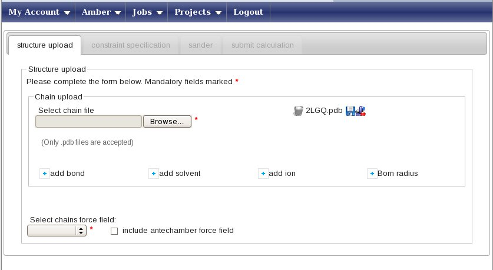

## Refinement of CYANA/Xplor-NIH structures that include Disulfide Bond

Before going into this tutorial, read carefully the description of RMD refinement of protein structures with only upper distance limits and dihedral angle restraints available in [this tutorial](../amber/).

Download the input constraints [here](COX17.tgz) and uncompress the files locally, download structure [2LGQ](http://www.rcsb.org/pdb/explore/explore.do?pdbId=2lgq) from Protein Data Bank.

Edit the file 2LGQ.pdb and rename all residues number  40 and 49 from CYS to CYX in any structures

```
ATOM    572  HB2 ALA A  39       7.483  -3.274  -5.161  1.00  1.41           H
ATOM    573  HB3 ALA A  39       5.826  -3.586  -4.614  1.00  1.68           H
ATOM    574  N   CYX A  40       3.465  -2.364  -6.263  1.00  0.51           N
ATOM    575  CA  CYX A  40       2.117  -2.541  -6.830  1.00  0.41           C
ATOM    576  C   CYX A  40       1.774  -1.430  -7.841  1.00  0.42           C
```

Create a new working project using the menu  “Projects” -> “Create”, with the project name “COX17”. 

Select the project “COX17” and press on the icon “Create a new Amber calculation” in the icon bar. You will be shown the following page:


Press the “Browse” button (its look may vary depending on your browser’s settings for language) and upload the 2LGQ.pdb file, which contains 20 conformers. You will be prompted a message asking if you want to use all of them in subsequent calculations - press yes. You window will now look like this:



Press on 'add bond' and in the small pop-up windows insert the atom names and residue numbers  where to create disulfide bond, from residue 40 atom SG and residue 49 atom SG:


<span style="color:red;">**In this example, we will perform a refinement in explicit water**</span>. To do so, press the “add solvent” button. This will open a small pop-up window; here select “TIP3PBOX” as the solvent type and “box” as the geometry; finally, type 10.0 in the Distance field.Press “Add a solvent” to close the pop-up and input these data. Now, in the “Select chains force field” menu, select the AMBER99SB force field. The “Constraint specification” tab will now become available, click on it.

At this point the procedure are equal to the general tutorial, remeber to use the differents NOE (Cox17_mut.upl)  and Dihedral angle (talos.aco) restraints provided as input.