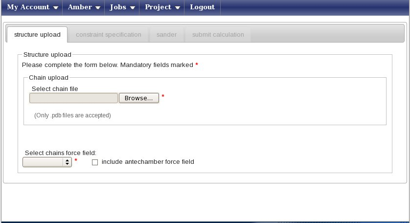
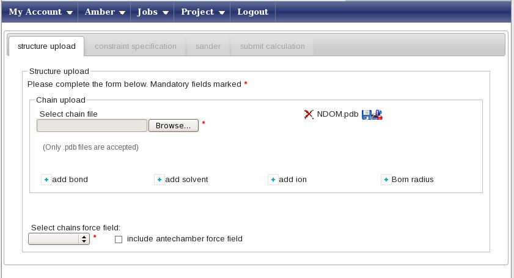
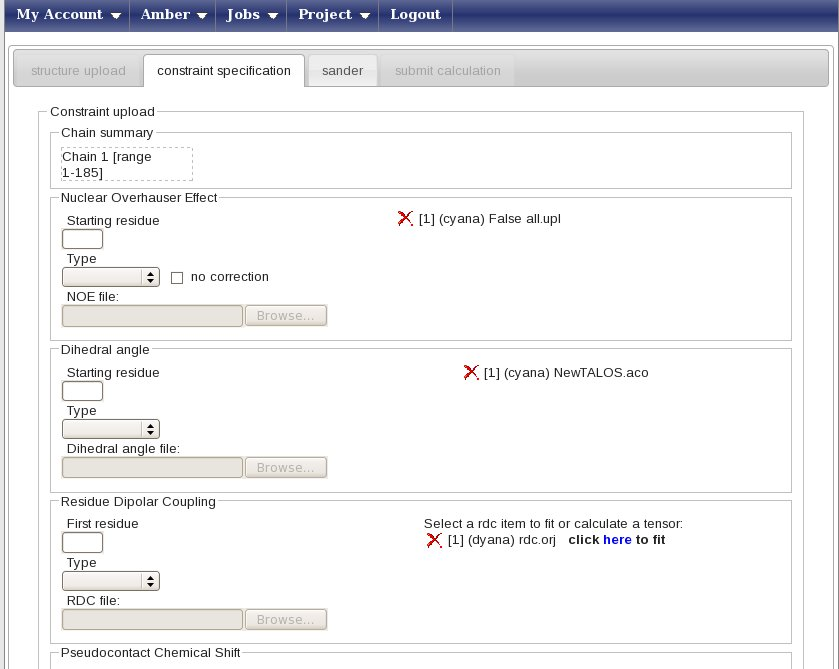
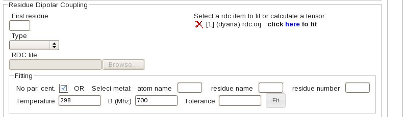
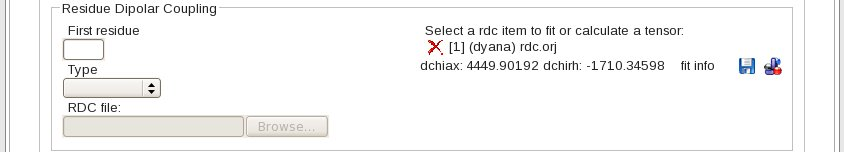
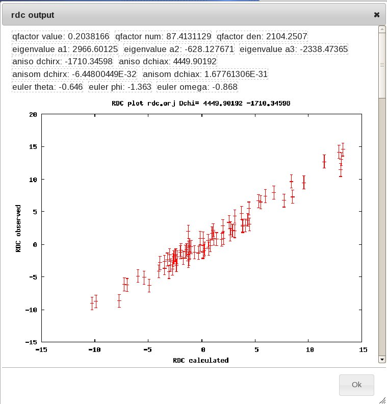
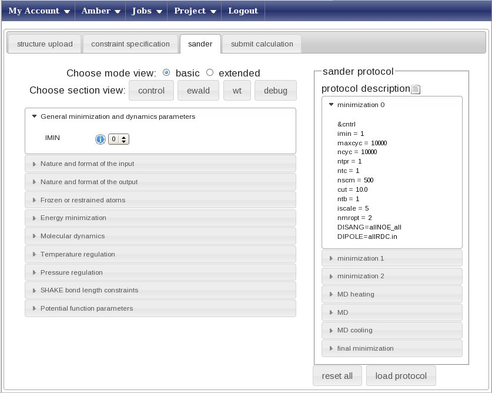

## Refinement of CYANA/Xplor-NIH structures with RDC's

Before going into this tutorial, read carefully the description of RMD refinement of protein structures with only upper distance limits and dihedral angle restraints available in [this tutorial](../amber/).

Download the input [here](demoRDC.tgz) and uncompress the files locally. The data are from structure [2KMV](http://www.rcsb.org/pdb/explore/explore.do?pdbId=2kmv)

Create a new working project using the menu “Projects” -> “Create”, with the project name “usecaseamberRDC”. 

Select the project “usecaseamberRDC” and press on the icon “Create a new Amber calculation” in the icon bar. You will be shown the following page:

Press the “Browse” button (its look may vary depending on your browser’s settings for language) and upload the NDOM.pdb file, which contains 20 conformers. You will be prompted a message asking if you want to use all of them in subsequent calculations - press yes. You window will now look like this

**In this example, we will perform a refinement in explicit water**. To do so, press the “add solvent” button. This will open a small pop-up window; here select “TIP3PBOX” as the solvent type and “box” as the geometry; finally, type 10.0 in the Distance field. Press “Add a solvent” to close the pop-up and input these data. Now, in the “Select chains force field” menu, select the AMBER99SB force field. The “Constraint specification” tab will now become available, click on it.

In this new page  you can enter your constraints, for this example we have file NOESY-derived upper distance limits (all.upl) and dihedral angle restraints (NewTALOS.aco) together with Residual Dipolar Couplings, RDC's. NOESY data and dihedrals are described in [this tutorial](../amber/).

For RDC constraints:

* type 1 in “Starting residue” (this is the number of the first amino acid in your pdb)
* choose the Dyana type in the Type menu
* upload the RDC file, called “rdc.orj” 

The result will be a page looking like this:

in the Residual Dipolar coupling box press on "here" to fit the tensor. The Fitting panel will then appear; select  the "No par. cent" entry (for residual dipolar couplings measured using orienting media such as phages)  and press the Fit button.

The tensor parameters are calculated using the Fantasian program (Banci,L. et al. (1997) Pseudocontact shifts as constraints for energy minimization and molecular dynamic calculations on solution structures of paramagnetic metalloproteins. Proteins Struct Funct Genet, 29, 68-76). The "fit info" link will display details on the parameters and the RDC fitting plot; alternatively, you can click on the disk to save a file containing the pdb and tensor coordinates, or display the protein with the tensor orientation using jmol (java is required).

Note that the tensor parameters are only used to initialize the AMBER calculation, but will be re-optimized by AMBER itself before starting the actual MD run. 

Now press on the “Sander” tab and get ready to set up the molecular dynamics parameters.In this page you can create from scratch (strongly discouraged) or choose a predefined protocol for the AMBER refinement (this uses the sander module of the AMBER package, hence the name of the tab).

Press the “Load protocol” button on the right side. This will show you a list of folders in the “sander protocol” box above the button, now choose the protocol called “**restrainedMDwithRDC.xml**”. This is a pre-build protocol that involves seven different steps going from heating to annealing. For each step, any parameter of the protocol can be changed or removed pressing the right mouse button with your pointer over the selected parameter. The left menu can be used to add parameters or to get info on them. We advise users to use the standard protocols unchanged.

Immediately after you select a protocol, the “submit calculation” tab will become available. Click on it, enter the name of your calculation (e.g. demoRDC) and press submit. The web portal will submit a separate calculation (aka job) for each of the 20 structures in the input NDOM.pdb. The results will by be stored in a subfolder of the “usecaseamber” project, having the name of your calculation (e.g. demo1).

The submission of the calculations to the grid will take few minutes. After all jobs have been submitted, you can press on the “check all” link to check the status of all the jobs. You can now logout, as this calculation will take a few hours.

From now on, you can follow the indications given in the introductory RMD with AMBER [tutorial](../amber/), with the only exception that the final results are stored in the sander6.* files.
