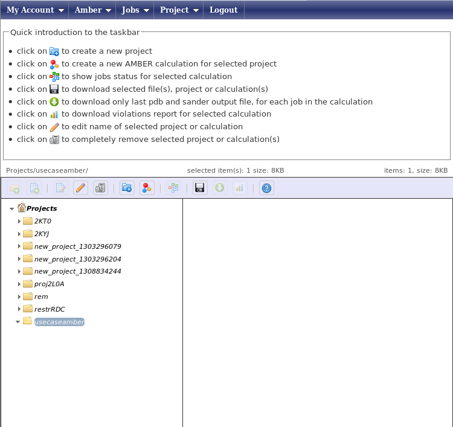
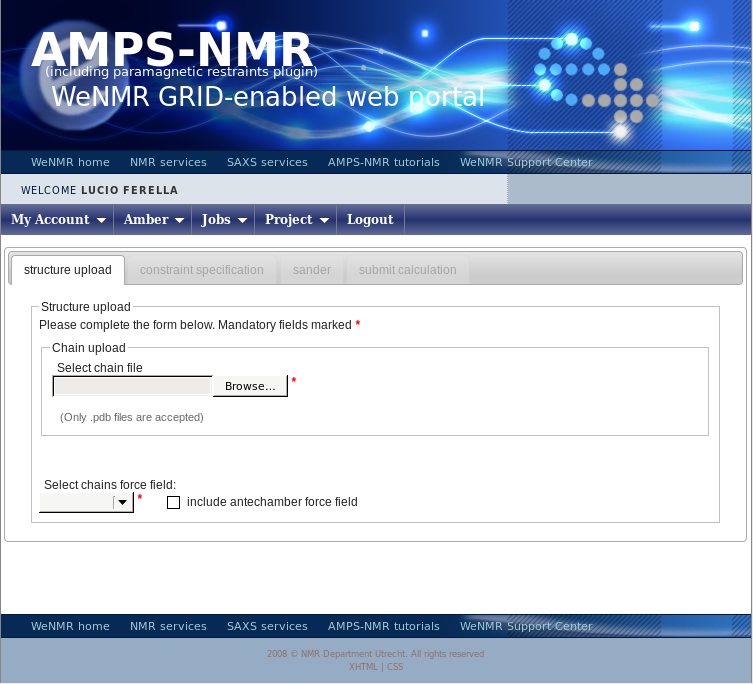
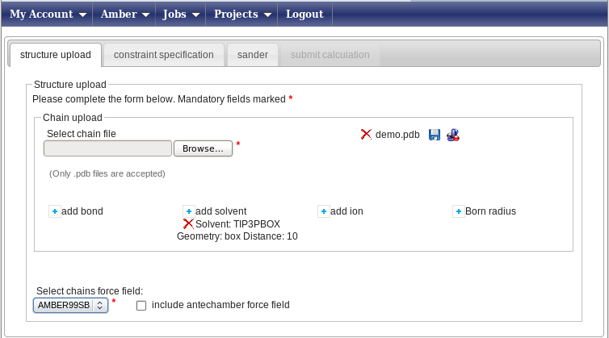
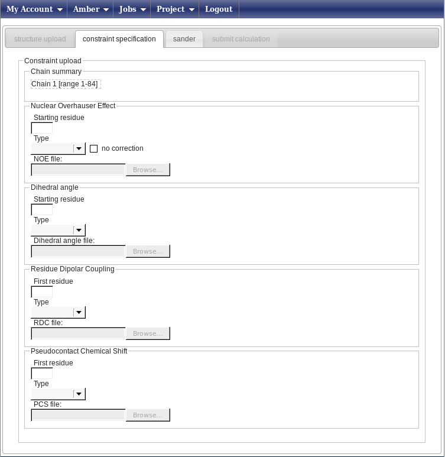
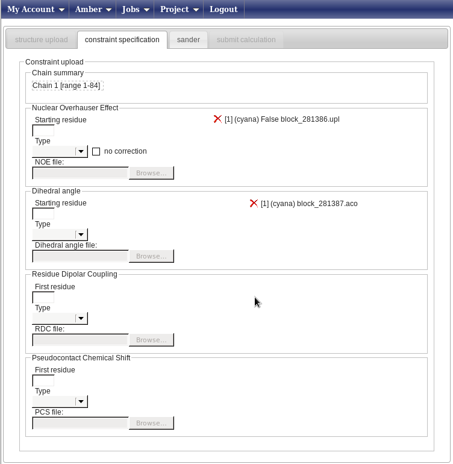
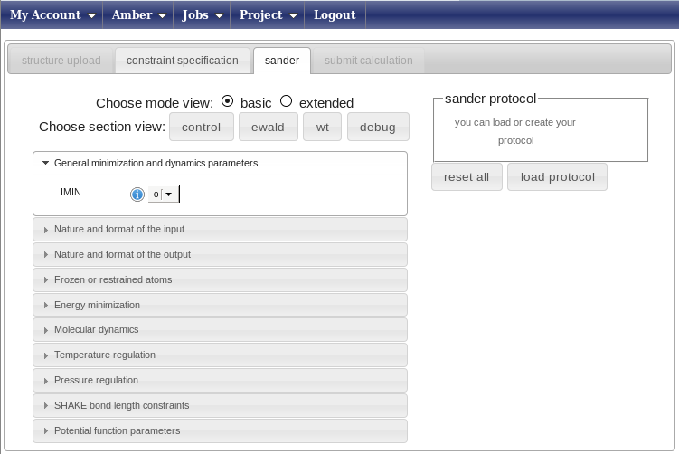
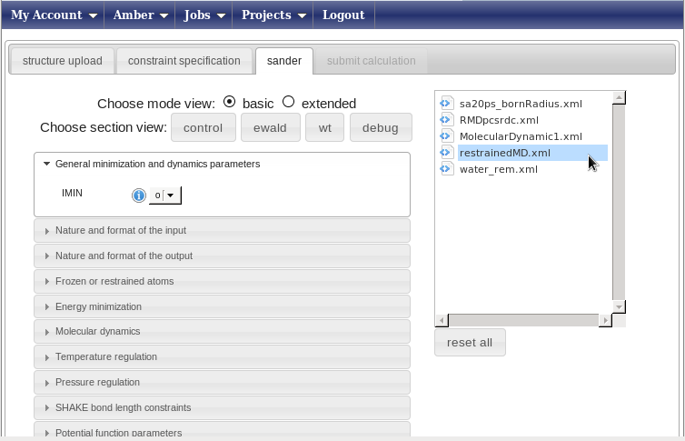
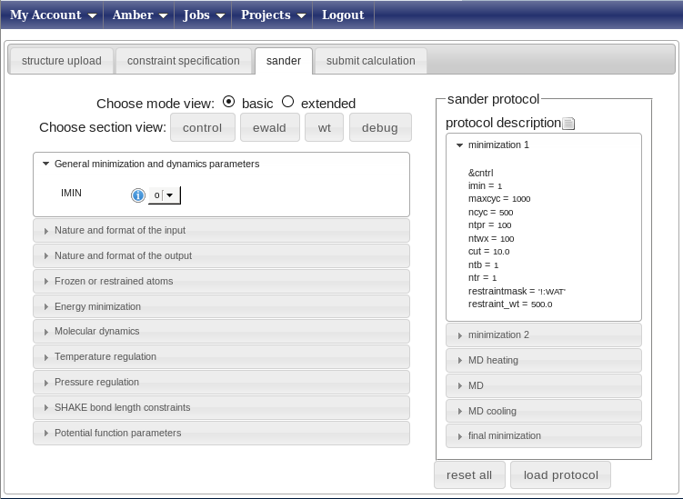
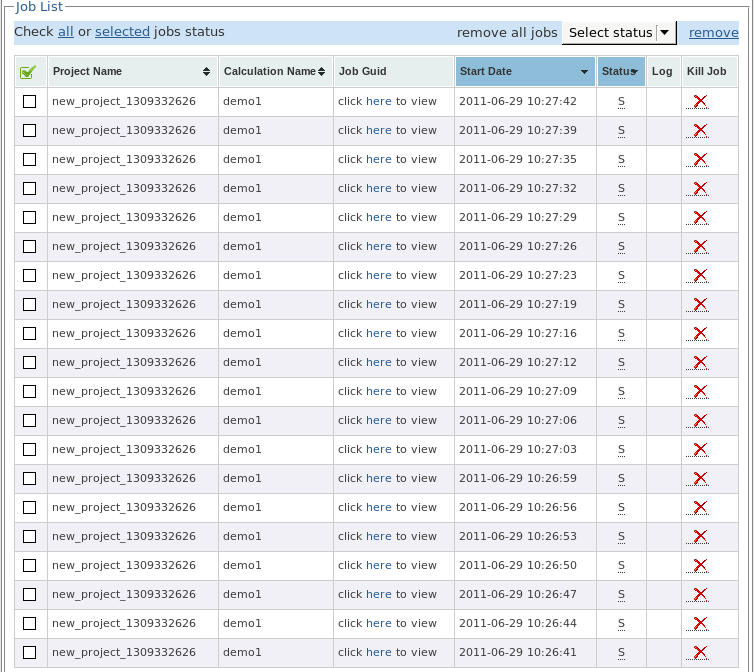

# Structure refinement using Restrained Molecular Dynamics (RMD) with the AMBER package

## RMD refinement of CYANA/Xplor-NIH structures

Download the input [here](2KT0_tutorial.zip) and uncompress the files locally. The data are from structure [2KT0](http://www.rcsb.org/pdb/explore/explore.do?pdbId=2kt0).

Create a new working project using the menu  “Projects” -> “Create”, with the project name “usecaseamber”. You will then see a page with a tree showing all of your projects.

Select the project “usecaseamber” and press on the icon “Create a new Amber calculation” in the icon bar. You will be shown the following page:

Press the “Browse” button (its look may vary depending on your browser’s settings for language) and upload the demo.pdb file, which contains 20 conformers. You will be prompted a message asking if you want to use all of them in subsequent calculations - press yes. You window will now look like this

**In this example, we will perform a refinement in explicit water**. To do so, press the “add solvent” button. This will open a small pop-up window; here select “TIP3PBOX” as the solvent type and “box” as the geometry; finally, type 10.0 in the Distance field. Press “Add a solvent” to close the pop-up and input these data. In this way, a box of water molecules with a distance of 10 Armstrong between the nearest protein atom and the surface of box will be created around your protein. Now, in the “Select chains force field” menu, select the AMBER99SB force field. The “Constraint specification” tab will now become available, click on it.

In this new page (below; the banner has been removed from the image to show all the available fields) you can enter your constraints.

For this example we only have file NOESY data and angle restraints. In the Nuclear Overhauser effect box, do the following:

* type 1 in “Starting residue” (this is the number of the first a.a. in your pdb)
* choose the Cyana type in the Type menu
* upload your local upper distance limit file called “block_281386.upl” as the NOE file

Then, repeat the first two steps in the “Dihedral angle” box and upload the file block_281387.aco. The result will be a page looking like this:

Now press on the “Sander” tab and get ready to set up the molecular dynamics parameters.In this page you can create from scratch (strongly discouraged) or choose a predefined protocol for the AMBER refinement (this uses the sander module of the AMBER package, hence the name of the tab).

Press the “Load protocol” button on the right side. This will show you a list of folders in the “sander protocol” box above the button. Open the folder “protocols”; the page will look like this.

Now choose the protocol called “restrainedMD.xml”. This is a pre-build protocol that involves six different steps going from heating to annealing. For each step, any parameter of the protocol can be changed or removed pressing the right mouse button with your pointer over the selected parameter. The left menu can be used to add parameters or to get info on them. We advise users to use the standard protocols unchanged.

Immediately after you select a protocol, the “submit calculation” tab will become available. Click on it, enter the name of your calculation (e.g. demo1) and press submit. The web portal will submit a separate calculation (aka job) for each of the 20 structures in the input demo.pdb. The results will by be stored in a subfolder of the “usecaseamber” project, having the name of your calculation (e.g. demo1).

The submission of the calculations to the grid will take 2-3 minutes. After all jobs have been submitted, you can press on the “check all” link to check the status of all the jobs. You can now logout, as this calculation will take a few hours.

When you login again, you must use the “Jobs” menu on the blue menu bar to access and check the status of the jobs, by clicking on “check all”. **The status of the jobs will not be automatically updated**. After the calculations are completed, the data will be automatically retrieved from the grid.

After retrieving the results, the “Projects” -> “manage” menu will allow you, by pressing “usecaseamber” -> “amber” -> "demo1"->“output”, to access all the output data. It is possible to browse the single directories and download the results by selecting the desired file and pressing on the download icon. The protocol used in this example provides a full output for each of its six steps. Therefore, for each conformer of the bundle, the calculations will create the sander0.out and sander0.pdb output files for the first step and so on for the other steps. The final minimized structure is contained in the sander5.pdb (for each conformer). Restraints violation can be read in the sander5.out output file.
